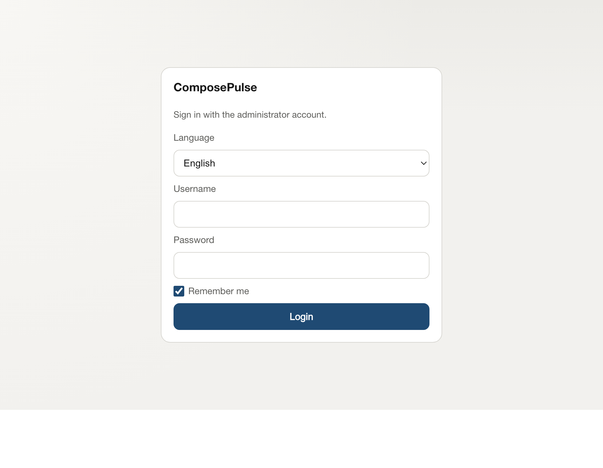
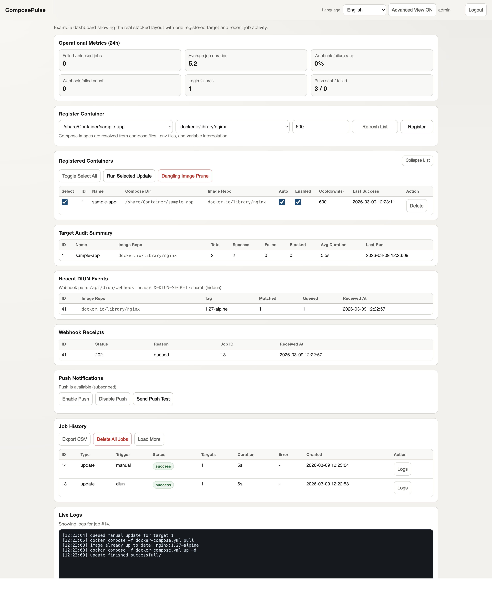

# ComposePulse

ComposePulse is a self-hosted web UI for safely updating selected Docker Compose apps on a NAS or Docker host.

It is built for setups where compose projects live under a single configured root path and you want a narrow, auditable workflow instead of a general-purpose container manager.

The current public release scope is desktop-first. Mobile browsers and installed PWA mode are best-effort conveniences, not part of the current release gate, so use a desktop browser for first setup and important operational changes.

<p align="center">
  
</p>

What ComposePulse does:

- Registers approved compose projects from a fixed root path
- Runs manual updates with `docker compose pull` and `docker compose up -d`
- Accepts DIUN webhooks and queues only matching targets for auto update
- Streams live job logs and dashboard updates
- Includes best-effort mobile/PWA support
- Keeps job history, audit summaries, DIUN events, and webhook receipts
- Runs `docker image prune -f` from the UI

What ComposePulse does not do:

- It does not browse arbitrary filesystem paths
- It does not write persistent data outside `/data`
- It does not execute arbitrary shell commands
- It is not a full Docker or Kubernetes control plane

## Screenshots

Login



Dashboard example



## Why This Repo Exists

Many self-hosted setups have a gap between "I can run `docker compose pull` manually" and "I trust a tool to auto-update the right stack without touching everything else."

ComposePulse is the middle ground:

- safer than handing a UI broad Docker host access and arbitrary path control
- easier than SSHing in for every single update
- more selective than blanket auto-update tools

## How It Works

1. ComposePulse runs as its own container.
2. It mounts one compose-project root as read-only and `/data` as writable app storage.
3. You register only the compose directories you want ComposePulse to manage.
4. For each target, ComposePulse stores one or more image repositories to match against DIUN events.
5. Updates run through a single in-process queue so jobs do not overlap.

Allowed runtime commands are intentionally limited to:

- `docker compose -f <compose_file> pull`
- `docker compose -f <compose_file> up -d`
- `docker image prune -f`

## Quick Start

### 1. Prerequisites

You need:

- Docker Engine with the Docker Compose plugin available inside the app container
- Your managed compose projects stored under one configured root path
- A writable directory for ComposePulse data
- [DIUN](https://crazymax.dev/diun/) if you want automatic updates; manual-only operation does not require it

Example target layout:

```text
/share/Container/
  app1/
    docker-compose.yml
  app2/
    compose.yaml
```

ComposePulse only accepts one-level directories under the configured root. With the bundled compose example, for instance:

- allowed: `/share/Container/app1`
- rejected: `/share/Container`
- rejected: `/share/Container/app1/subdir`

### 2. Create `.env`

```bash
cp .env.example .env
```

Minimum required values:

```env
ADMIN_USERNAME=admin
ADMIN_PASSWORD=change-me-admin-password
DIUN_WEBHOOK_SECRET=change-me-diun-webhook-secret
APP_DATA_BIND_DIR=data
```

Notes:

- `APP_DATA_BIND_DIR=data` stores the SQLite DB and app state in `./data`
- If you prefer a NAS path, use something like `/share/Container/composepulse/data`
- `DIUN_WEBHOOK_SECRET` is still required by the app configuration even if you start with manual-only updates

Generate a strong DIUN secret:

```bash
./scripts/generate_diun_secret.sh
```

Optional: generate Web Push VAPID keys:

```bash
./scripts/generate_vapid_keys.sh
```

If your `.env` lives elsewhere:

```bash
./scripts/generate_diun_secret.sh /path/to/.env
./scripts/generate_vapid_keys.sh /path/to/.env
```

### 3. Start ComposePulse

Build from the local checkout:

```bash
docker compose up -d --build
```

Pull a published Docker Hub image instead:

```bash
COMPOSEPULSE_IMAGE=changjo/composepulse:v0.1.0 docker compose -f docker-compose.image.yml up -d
```

Default URL:

- `http://<HOST-IP>:8087/login`

File roles:

- [`docker-compose.yml`](./docker-compose.yml): build from the current checkout
- [`docker-compose.image.yml`](./docker-compose.image.yml): pull a published image from Docker Hub

The Docker Hub compose file defaults to `changjo/composepulse:latest`, but pinning `COMPOSEPULSE_IMAGE` to a release tag such as `changjo/composepulse:v0.1.0` is safer for production.

If you are not using `/share/Container`, override both the read-only bind mount and `CONTAINER_ROOT` in your own local override file such as `docker-compose.custom.yml`. Do not commit personal override files to the public repository.

### 4. Log In

Use the credentials from `.env` and sign in at:

- `http://<HOST-IP>:8087/login`

### 5. Register Your First Target

After login:

1. Open `Register Container`.
2. Pick a discovered compose project.
3. Pick the image repository that should trigger updates for that target.
4. Save the target.

Discovery resolves compose `image:` values with `.env` and environment-variable interpolation, so a target can map to multiple repositories through `image_repos`.

### 6. Run a Manual Update

1. Select one or more rows in `Registered Containers`.
2. Click `Run Selected Update`.
3. Watch the job in `Live Logs`.

### 7. Connect DIUN (Required for Auto Update)

1. Enable `Auto` for the target.
2. Deploy or configure [DIUN](https://crazymax.dev/diun/) to watch the same image repositories.
3. Point DIUN at the webhook endpoint.
4. When DIUN sends an event for a matching repository, ComposePulse queues only the matching target.

## DIUN Webhook Configuration

Automatic updates depend on [DIUN](https://crazymax.dev/diun/) as the upstream image-change detector. If you only use manual updates, you can skip the DIUN runtime setup and ignore this section until you enable auto-update.

Recommended internal webhook target:

- URL: `http://composepulse:8087/api/diun/webhook`
- Header: `X-DIUN-SECRET: <DIUN_WEBHOOK_SECRET>`

ComposePulse accepts DIUN repository information from these payload fields:

- `entry.image.name`
- `entry.image.repository`
- `entry.repository`
- `image.repository`
- `repository`
- `image`

Repository matching is normalized before comparison:

- `nginx` becomes `docker.io/library/nginx`
- `myorg/app` becomes `docker.io/myorg/app`
- `repo:tag` is matched as `repo`

Notes:

- `/api/diun/webhook/config` returns a masked secret by default
- Only set `WEBHOOK_CONFIG_SHOW_SECRET=true` if you explicitly want the raw secret exposed in the UI
- Cooldown windows and maintenance windows can be used to suppress duplicate or badly timed auto updates
- Existing targets from older builds are normalized to canonical repository names on startup so Docker Hub shorthand values such as `nginx` keep matching DIUN webhook payloads

## Security Model

- Dashboard APIs require a login session cookie
- Login requests are rate-limited by IP and username
- DIUN webhooks require `X-DIUN-SECRET`
- Compose directories are restricted to one level under the configured `CONTAINER_ROOT`
- App data stays under `/data`
- Runtime commands are allowlisted and fixed

For internet-exposed deployments, put ComposePulse behind a reverse proxy and optionally add edge auth such as Caddy BasicAuth.

## Reverse Proxy Examples

### Caddy

```caddyfile
composepulse.example.com {
  reverse_proxy composepulse:8087
}
```

With BasicAuth:

```caddyfile
composepulse.example.com {
  basicauth {
    admin <bcrypt-hash>
  }
  reverse_proxy composepulse:8087
}
```

### Traefik (Docker Labels)

```yaml
services:
  composepulse:
    labels:
      - "traefik.enable=true"
      - "traefik.http.routers.composepulse.rule=Host(`composepulse.example.com`)"
      - "traefik.http.routers.composepulse.entrypoints=websecure"
      - "traefik.http.routers.composepulse.tls=true"
      - "traefik.http.services.composepulse.loadbalancer.server.port=8087"
```

With BasicAuth:

```yaml
services:
  composepulse:
    labels:
      - "traefik.enable=true"
      - "traefik.http.routers.composepulse.rule=Host(`composepulse.example.com`)"
      - "traefik.http.routers.composepulse.entrypoints=websecure"
      - "traefik.http.routers.composepulse.tls=true"
      - "traefik.http.services.composepulse.loadbalancer.server.port=8087"
      - "traefik.http.middlewares.composepulse-auth.basicauth.users=admin:$$2y$$14$$..."
      - "traefik.http.routers.composepulse.middlewares=composepulse-auth"
```

## Optional Features

### Web Push

Web Push is disabled by default.

```env
WEB_PUSH_ENABLED=false
# WEB_PUSH_VAPID_PUBLIC_KEY=
# WEB_PUSH_VAPID_PRIVATE_KEY=
# WEB_PUSH_SUBJECT=mailto:admin@example.com
```

When enabled, the UI provides:

- device-specific push subscription management
- push test delivery
- badge clearing when the app is opened

Notes:

- Each browser or device must subscribe separately
- Rotating VAPID keys invalidates existing subscriptions
- Push status lookup uses a timeout and fallback path so it does not block the rest of the dashboard

### PWA Install (Best-Effort)

- Android: use the browser install or add-to-home-screen menu
- iPhone: Safari -> Share -> Add to Home Screen
- If you change iPhone icons later, remove the existing shortcut and add it again
- After frontend updates, reopen or refresh the installed app once so the latest cached assets are activated
- Web Push on iOS requires iOS 16.4+
- Mobile/PWA behavior is not part of the current public release gate; treat it as convenience functionality rather than the primary operating path

## Important Environment Variables

Required:

- `ADMIN_USERNAME`
- `ADMIN_PASSWORD`
- `DIUN_WEBHOOK_SECRET`
- `APP_DATA_BIND_DIR`

Frequently adjusted optional values:

- `CONTAINER_ROOT` (when overridden in your local compose file)
- `WEBHOOK_CONFIG_SHOW_SECRET`
- `COOLDOWN_SECONDS`
- `PULL_RETRY_MAX_ATTEMPTS`
- `PULL_RETRY_DELAY_SECONDS`
- `AUTO_UPDATE_WINDOW_START_HOUR`
- `AUTO_UPDATE_WINDOW_END_HOUR`
- `LOGIN_RATE_LIMIT_WINDOW_SECONDS`
- `LOGIN_RATE_LIMIT_MAX_ATTEMPTS`
- `LOGIN_RATE_LIMIT_LOCK_SECONDS`
- `WEB_PUSH_ENABLED`
- `WEB_PUSH_VAPID_PUBLIC_KEY`
- `WEB_PUSH_VAPID_PRIVATE_KEY`
- `WEB_PUSH_SUBJECT`

## API Summary

| Method | Path | Description | Auth |
|---|---|---|---|
| GET | `/api/health` | Health check | None |
| POST | `/api/auth/login` | Log in | None |
| POST | `/api/auth/logout` | Log out | None |
| GET | `/api/auth/me` | Session state | None |
| GET | `/api/containers/discover` | Discover registration candidates | Session |
| GET | `/api/targets` | List registered targets | Session |
| POST | `/api/targets` | Add a target | Session |
| PATCH | `/api/targets/{id}` | Update target settings | Session |
| DELETE | `/api/targets/{id}` | Delete a target | Session |
| POST | `/api/jobs/update` | Queue selected update | Session |
| POST | `/api/jobs/prune` | Queue prune | Session |
| POST | `/api/jobs/delete-all` | Delete all jobs | Session |
| GET | `/api/jobs` | List jobs | Session |
| DELETE | `/api/jobs/{id}` | Delete a job | Session |
| GET | `/api/jobs/export.csv` | Export jobs as CSV | Session |
| GET | `/api/jobs/{id}/stream` | Job log SSE | Session |
| GET | `/api/stream/dashboard` | Dashboard patch SSE | Session |
| GET | `/api/audit/targets` | Audit summary | Session |
| GET | `/api/diun/events` | Recent DIUN events | Session |
| GET | `/api/diun/receipts` | Webhook receipts | Session |
| GET | `/api/diun/webhook/config` | Webhook config | Session |
| GET | `/api/metrics` | Operational metrics | Session |
| GET | `/api/push/config` | Push configuration and device status | Session |
| POST | `/api/push/subscriptions` | Register or update a push subscription | Session |
| DELETE | `/api/push/subscriptions` | Remove a push subscription | Session |
| POST | `/api/push/test` | Send a push test | Session |
| POST | `/api/diun/webhook` | Receive DIUN webhook | `X-DIUN-SECRET` |

Common error format:

```json
{"error":"message","code":"error_code"}
```

Example login rate-limit response:

```json
{"error":"too many login attempts, try again later","code":"auth_rate_limited","retry_after_seconds":120}
```

## Local Development

Start a local preview:

```bash
./scripts/dev_local_ui.sh start
```

Useful commands:

```bash
./scripts/dev_local_ui.sh start-hot
./scripts/dev_local_ui.sh logs
./scripts/dev_local_ui.sh restart
./scripts/dev_local_ui.sh restart-hot
./scripts/dev_local_ui.sh stop
./scripts/dev_local_ui.sh clean
```

## Testing

If Go is installed locally:

```bash
go test ./...
```

Dockerized Go toolchain:

```bash
docker run --rm -v "$PWD":/src -w /src golang:1.22-alpine sh -lc 'apk add --no-cache build-base >/dev/null && /usr/local/go/bin/gofmt -w main.go main_test.go integration_test.go diun_fixture_test.go && CGO_ENABLED=1 /usr/local/go/bin/go test ./...'
```

Manual QA report template:

- `docs/QA_REPORT_TEMPLATE.md`

## Releases and Docker Images

GitHub Actions handles both verification and image publishing:

- `.github/workflows/ci.yml` runs on `main` pushes and pull requests
- `.github/workflows/release.yml` runs on tag pushes that match `v*`
- Release builds publish multi-arch Docker Hub images for `linux/amd64` and `linux/arm64`
- A GitHub Release is created automatically from the pushed tag

Configure these repository settings before the first release tag:

- Required repository variable: `DOCKERHUB_USERNAME`
- Required repository secret: `DOCKERHUB_TOKEN`
- Optional repository variable: `DOCKERHUB_NAMESPACE`
- Optional repository variable: `DOCKERHUB_IMAGE_NAME`

Defaults:

- `DOCKERHUB_NAMESPACE` defaults to `DOCKERHUB_USERNAME`
- `DOCKERHUB_IMAGE_NAME` defaults to the GitHub repository name

Tag behavior:

- Stable tag `v0.1.0` publishes `docker.io/<namespace>/<image>:v0.1.0`
- Stable tag `v0.1.0` also publishes `docker.io/<namespace>/<image>:v0.1`
- Stable tag `v0.1.0` also updates `docker.io/<namespace>/<image>:latest`
- Prerelease tag `v0.2.0-rc1` publishes only `docker.io/<namespace>/<image>:v0.2.0-rc1`

Create a release:

```bash
git tag v0.1.0
git push origin v0.1.0
```

If you want to deploy from Docker Hub instead of building locally, use [`docker-compose.image.yml`](./docker-compose.image.yml). It reads `COMPOSEPULSE_IMAGE` and defaults to `changjo/composepulse:latest`.

Recommended pinned-tag launch:

```bash
COMPOSEPULSE_IMAGE=changjo/composepulse:v0.1.0 docker compose -f docker-compose.image.yml up -d
```

Its service definition is:

```yaml
services:
  composepulse:
    image: "${COMPOSEPULSE_IMAGE:-changjo/composepulse:latest}"
    container_name: composepulse
    user: "0:0"
    environment:
      ADMIN_USERNAME: "${ADMIN_USERNAME}"
      ADMIN_PASSWORD: "${ADMIN_PASSWORD}"
      DIUN_WEBHOOK_SECRET: "${DIUN_WEBHOOK_SECRET:?DIUN_WEBHOOK_SECRET is required}"
      DB_PATH: /data/app.db
      CONTAINER_ROOT: /share/Container
      PORT: "8087"
    volumes:
      - /var/run/docker.sock:/var/run/docker.sock
      - /share/Container:/share/Container:ro
      - ${APP_DATA_BIND_DIR}:/data
    restart: unless-stopped
    ports:
      - "8087:8087"
```

## Open-Source Pre-Publish Checks

```bash
./scripts/prepublish_check.sh
```

Detailed checklist:

- `docs/OPEN_SOURCE_RELEASE_CHECKLIST.md`

## License

This project is released under the [MIT License](./LICENSE).
